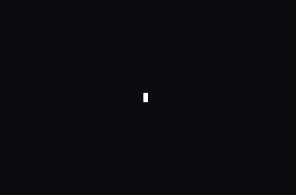

# tte

Terminal text effects: a selection of the effects from
[TerminalTextEffects](https://github.com/ChrisBuilds/terminaltexteffects),
animated in place in the terminal, with the engine underneath them rewritten
for TurboPython, plus three effects of our own. ~5500 lines.



*`tpy tte.py`: spawn, the default effect, in a 66×22 terminal at 30 frames a
second. The other effects are listed by `tpy tte.py -h`.*

## Run

```bash
tpy tte.py                          # spawn, over a built-in demo text
tpy tte.py -h                       # the options, and every effect
tpy tte.py thunderstorm             # another effect
tpy tte.py burn -i notes.txt        # over a file
ls -l | tpy tte.py decrypt          # over whatever is piped in
tpy tte.py matrix --seed 7          # the same run every time
tpy tte.py wipe --frame-rate 20     # in slow motion (0: as fast as possible)
tpy tte.py --demo                   # every effect in turn, over the demo text
```

Run with no arguments, it plays `spawn`, one of the effects written for this port; `-h`
lists the others and what each one does. In `--demo`, once an effect finishes, a
small light flies across the terminal under it, left to right, leaving a dark
rule before the next one starts. The effects are `beams`, `matrix`, `decrypt`,
`burn`, `thunderstorm`, `expand`, `highlight`, `print`, `vhstape`, `wipe`,
`laseretch`, `blackhole`, `spotlights`, `fireworks`, `swarm`, `crumble`, `rings`,
`spawn`, `sandstorm` and `donut`. With neither `-i` nor piped
input, an effect plays over a built-in demo text: a banner, a subtitle naming
the effect, three short paragraphs about TurboPython and this port, and a
pointer to `-h`. Input is plain text. The canvas is the size of the text,
clipped to the terminal, and each effect runs at 60 frames a second unless
`--frame-rate` says otherwise; that only paces the drawing, so every frame is
still drawn. The terminal needs 24-bit color. Stopping an effect with Ctrl-C
leaves the cursor hidden; `tput cnorm` brings it back (see below).

When stdout is not a terminal nothing is drawn. Instead each effect renders
its frames as fast as it can and prints how many there were, plus an FNV-1a
digest of their bytes. With no `--seed` that run is seeded with 0, and the
`--demo` run of it is what the test harness records. With a seed, each effect
is seeded afresh, so its line is the same whether it runs alone or in turn.

## What it shows

- **Characters are indices, not references.** In TTE a character object is
  shared by the canvas, the set of animating characters, event handlers and
  particle pools. Here the `Terminal` owns every character in one list, and
  everything else holds `int32` indices into it. There is no shared ownership,
  so there is no `Rc` and no `Ptr`.
- **Events are data.** TTE's characters carry an event registry that runs
  callbacks ("when this scene completes, activate that one, then call this
  function"). Here a character that finishes a scene or path reports an `Event`
  (a small value record), and after each tick the effect reads the events and
  decides what happens next. Each effect's `update()` is short and shows its
  whole state machine in one place. The reactions that must happen mid-tick
  are data too: a path can name the path that follows it, the scene it
  starts and the scene it ends with, whether it stops the current scene, and
  the layer the character moves to (vhstape's glitch springs back into its
  restore path; a swarm hops from area to area; the collapsing black hole
  flickers as it reaches the center).
- **Values handed over with `Own`.** An effect builds a `Scene` or `Path` as a
  local and gives it to a character with `add_scene` / `add_path`, which take
  `Own[...]`. The local is moved in, not copied.
- **Small immutable records as `ValueType`s:** `Coord`, `Color`, `Visual`,
  `Frame`, `Segment`, `Event` and the `CubicBezier` easing curve. They copy
  freely and can be dictionary keys (`dict[Coord, Color]` for the gradients).
- **Callables in fields.** A scene's or path's easing is a
  `Callable[[float], float] | None`. It holds either a plain function
  (`in_circ`, `out_quint`) or an instance of a class with `__call__`
  (`CubicBezier`).
- **A generic function over a protocol:** `play[E: Effect]` drives any effect
  with `step()` and `frame()`.
- The terminal plumbing: `argparse`; piped input read from file descriptor 0
  with `os.read`; `os.isatty` and `os.get_terminal_size`; frame pacing with
  `time.monotonic` and `time.sleep`; drawing in place with raw ANSI escape
  sequences.
- `enum` plus `match` (`Direction`, `Grouping`, `EventKind`), recursion in
  laying out forked lightning bolts, and Prim's algorithm growing the random spanning tree
  that burn spreads along.

## Origin

Based on [TerminalTextEffects](https://github.com/ChrisBuilds/terminaltexteffects)
0.15.0 by ChrisBuilds, at commit `205461e`: its engine and a selection of its effects.
The effects keep TTE's logic, default settings and colors. The engine was
rewritten for TurboPython (see below).

License, verbatim from the repository's `LICENSE`:

> ```
> MIT License
>
> Copyright (c) [2023] [ChrisBuilds]
>
> Permission is hereby granted, free of charge, to any person obtaining a copy
> of this software and associated documentation files (the "Software"), to deal
> in the Software without restriction, including without limitation the rights
> to use, copy, modify, merge, publish, distribute, sublicense, and/or sell
> copies of the Software, and to permit persons to whom the Software is
> furnished to do so, subject to the following conditions:
>
> The above copyright notice and this permission notice shall be included in all
> copies or substantial portions of the Software.
>
> THE SOFTWARE IS PROVIDED "AS IS", WITHOUT WARRANTY OF ANY KIND, EXPRESS OR
> IMPLIED, INCLUDING BUT NOT LIMITED TO THE WARRANTIES OF MERCHANTABILITY,
> FITNESS FOR A PARTICULAR PURPOSE AND NONINFRINGEMENT. IN NO EVENT SHALL THE
> AUTHORS OR COPYRIGHT HOLDERS BE LIABLE FOR ANY CLAIM, DAMAGES OR OTHER
> LIABILITY, WHETHER IN AN ACTION OF CONTRACT, TORT OR OTHERWISE, ARISING FROM,
> OUT OF OR IN CONNECTION WITH THE SOFTWARE OR THE USE OR OTHER DEALINGS IN THE
> SOFTWARE.
> ```

## Our own effects: spawn, sandstorm and donut

`spawn` is not one of TTE's. White-blue flames grow at the center of the canvas,
flickering with plasma glyphs, and then sweep outwards as a ring of fire that
burns out as it spreads. Midway, the canvas flashes white and the text appears
under the flash. Some characters show at once; the rest boil as flickering
plasma first. Each then cools from
white-hot to its final colors at its own pace. Those colors are a blue, white and gold
gradient laid at an angle, which the engine gained for it
(`Terminal.text_colors_at_angle`). It is built from the same engine as the
ported effects, with a list of glow characters covering the canvas, redrawn
every frame.

`sandstorm` isn't one of TTE's either. Sand blows fast and nearly flat across
the canvas, pooled particles like thunderstorm's rain, and the text drifts in
with it, piling up from the bottom as restless letters that keep changing.
Partway through, a front sweeps in from the left and settles each letter:
a few quick random letters, warming from sand to a pale sand gradient, then
the right one. Letters the front passes before they have landed settle as
they land. The wind drops as the text settles and stops with the last letter.

`donut` pays tribute to Andy Sloane's
[donut.c](https://www.a1k0n.net/2011/07/20/donut-math.html) (2006), whose
maths it follows: a torus swept point by point, the nearest point kept in each
cell, and shaded `.,-~:;=!*#$@` by how squarely it faces the light. The code
is written from that explanation, not taken from donut.c. The donut starts as
a single dot far away and flies in, spinning; then it slows to rest while the
camera closes in until its side fills the canvas. The text turns out to be
written there. Before the effect starts, that closing pose is rendered once, and
every point of the surface that lands in a cell of the text is given that
cell's character; every frame sweeps the same grid of points, so the letters
show curved on the turning donut and land exactly in place. As they appear,
the rest of the surface darkens away.

## Changes from the original

- **A selection of TTE's effects**, each with its default settings. TTE turns
  every effect's typed config dataclass into command-line options by
  reflection. Here the settings are module constants at the top of each effect.
- **An engine sized to these effects.** It keeps frame-by-frame, eased and
  path-synced scenes, gradients, and paths of straight or single-control-point
  Bézier segments with easing, hold times and looping. It also keeps particle
  pools, the sequence easer, circle geometry, two spanning-tree algorithms
  (Prim's and a recursive backtracker), and the row, column and diagonal
  groupings that these effects use. A path may have several waypoints, each
  straight or curved through one control point. It drops multi-point Bézier
  controls, segment events, and the other groupings, sort orders and spanning
  trees.
- **Characters by index, events as data** (see *What it shows*). In place of
  TTE's `register_event(...)` table, each effect's `update()` reacts to
  `SCENE_COMPLETE` and `PATH_COMPLETE`. For example, decrypt moves a
  character from `fast_decrypt` to `slow_decrypt` to `discovered`, and
  thunderstorm returns a raindrop to its pool when its fall ends. Where TTE
  reacts inside the tick and a later reaction would show a different frame
  (vhstape, blackhole), `add_path` records the follow-on path and scenes
  instead.
- **Frames instead of wall-clock time.** TTE rains for 15 seconds (matrix) and
  storms for 12 (thunderstorm), measured by the clock. The port counts 900 and
  720 frames: the same time at TTE's 60 frames a second, but the same run on
  any terminal and repeatable with a seed.
- **Animating characters tick in the order they started.** TTE keeps them in a
  `set`, which iterates in an order set by memory addresses. In burn and
  thunderstorm, characters draw random numbers as they tick, so TTE's output
  differs from run to run even with a fixed seed. An insertion-ordered list
  makes the port repeatable.
- **Plain-text input and a fixed layout.** The port doesn't parse ANSI colors
  in the input (TTE's `--existing-color-handling`) and assumes one cell per
  character, so wide CJK characters are out. Tabs expand to 4-column stops,
  and long lines are clipped, not wrapped. The canvas is anchored bottom-left,
  TTE's default, with none of its canvas, anchor, XTerm-256 or no-color
  options.
- **The command line** keeps TTE's effect name and `-i`, and adds `--demo`
  and `--seed`. With no arguments it prints its help, and without
  input an effect plays over a built-in demo text. The summary printed when
  stdout is not a terminal is new too.

## TurboPython bugs worked around

- **`str` indexes bytes, not characters.** `len()`, indexing and iteration
  see UTF-8 bytes, so the box-drawing banner and the rain symbols would fall
  apart. `split_characters` encodes the text and decodes one UTF-8 sequence at
  a time. Code-point strings are planned in tpy-lang's
  `docs/STRING_WIDTH_DESIGN.md`; revert once `str` indexes by code point.
- **`chr()` above 127 returns one wrong byte.** It compiles to
  `static_cast<char>`. decrypt's cipher symbols, which TTE builds with `chr()`
  over code point ranges, are spelled out as string literals. Not filed
  upstream yet.
- **Ctrl-C can't be caught.** TTE restores the cursor in a `finally` when it
  is interrupted. Outside `asyncio`, TurboPython doesn't turn SIGINT into
  `KeyboardInterrupt`, and `signal.signal` doesn't exist yet. So stopping an
  effect early leaves the cursor hidden; `tput cnorm` shows it again. The
  `signal` module is at ~5% in tpy-lang's stdlib roadmap; restore the cursor
  in a `finally` once handlers can be installed.
- **`sys.stdin` is missing.** Piped text is read with `os.read(0, ...)`.
  Tracked in tpy-lang's `TODO.md` ("Downstream-blocked stdlib gaps (2026-08-03
  port report)").
- **`random` skips the draw for a one-value range.** For `randint(a, a)` (and
  `randrange(1)` or `choice` of one element), CPython still draws random bits
  and TurboPython returns at once. The two runs' random streams then part
  company, which one-line input triggers constantly. `rng.randint` draws
  those bits itself, and every `randint` in the port goes through it, as do
  sandstorm's random letters, drawn from a pool that can hold just one. The
  remaining `randrange` and `choice` calls always have more than one value
  to choose from. Not filed upstream yet.
- **Call arguments evaluate right to left.** Where one expression made several
  random draws, the draws are bound to locals first: decrypt's typing frame,
  the fire's starting cell, a spark's target, and a sandstorm grain's symbol
  and shade. Tracked in tpy-lang's
  `BUGS.md` (`subexpression-right-to-left-eval`).
- **A closure built from nested `def`s captures its parameters by
  reference.** TTE's `make_easing(x1, y1, x2, y2)` returns an inner function.
  Compiled, that function reads its parameters from `make_easing`'s stack frame
  after it has returned, so the lightning flash eased along garbage. Returning
  a callable-class instance as a `Callable` isn't supported either, so the
  thunderstorm builds a `CubicBezier` directly. Not filed upstream yet.
- **An `Optional` field of a `ValueType` record can't be set in a
  constructor.** `Visual` has `fg: Color` plus `colored: bool` rather than
  `fg: Color | None`. Tracked in tpy-lang's `BUGS.md`
  (`valuetype-optional-ctor-member-init`).
- **A `ValueType` field can't be bound to a local or passed on directly.**
  `coord = character.input_coord` is refused, as are such a field (or a
  `copy()` of it) as a call argument, and `return self.frames[i].visual`. So
  the port takes a `copy()` into a local first, returns `Own[...]`
  (`visual_at`, `Path.step`), and gives `Character` small methods
  (`move_to`, `return_home`, `set_symbol`, `set_scene_ease`) where a field
  write through a list element is refused too. Not filed upstream yet.
- **`list.sort(key=...)` is missing, and a `sorted(key=lambda ...)` that
  captures `self` is refused.** `Terminal.characters()` and `grouped()` sort
  `(key, ..., id)` tuples. Not filed upstream yet.
- **`int(text, 16)` is missing.** `hex_color` looks each digit up in
  `"0123456789abcdef"`. Not filed upstream yet.
- **`random.choice` can't infer its element type for a list of records.**
  `graphics.choose_color` indexes with `rng.randint(0, len(colors) - 1)`,
  which draws exactly as `choice` does. Not filed upstream yet.
- **A conditional expression mixing a list element and a string literal
  dangles.** In swarm, `then = names[i + 1] if ... else ""` compiled to a
  `std::string_view` of the temporary `std::string` the C++ `?:` produces, so
  the name stored from it was garbage and the run failed with a `KeyError`. It
  is a plain `if` now. Not filed upstream yet.
- **A name bound in one `if` branch and reused as a loop variable in another
  isn't declared there.** crumble's reset loop failed to compile (`'char_id'
  was not declared in this scope`) until it got a name of its own. Not filed
  upstream yet.
- **A local named `char` breaks the C++ build.** One `char` local was declared
  as `char` but used as `char_`. Character locals are called `character`. Not
  filed upstream yet.
- **`argparse` gaps.** `--help` leaves out a positional's `choices`, so the
  effect names would not appear in it; `choices=` must also be a list
  literal. Instead the effect is checked against `EFFECTS` by hand, and the
  help's epilog lists the effects. `parser.print_help()` can't be called inside an
  `if` (the builder-trace macro refuses it), so a bare run parses
  `["--help"]` in place of empty arguments. Not filed upstream yet.
- **A mutation through a local alias doesn't count as mutating.** In print's
  `Row.move_up(term)`, `character = term.chars[i]` followed by
  `character.move_to(...)` left `term` inferred read-only, and the C++ build
  failed ("discards qualifiers"). The call goes through `term.chars[i]`
  directly. Not filed upstream yet.
- **A skipped default is resolved in the caller's module.** With `Scene`'s
  parameters as `(name, sync=Sync.NONE, looping=False)`, laseretch's
  `Scene("laser", looping=True)` failed with `Undefined variable: 'Sync'`,
  since laseretch doesn't import `Sync`. `sync` now comes last, where it is
  never skipped over. Tracked in tpy-lang's `BUGS.md` ("A materialized
  parameter default that names a module-level constant or enum member
  resolves in the CALLER's scope").
- **Smaller constructs the code generator doesn't handle yet** were rewritten
  with a local, a loop or a helper. Each compiles fine in its rewritten form:
  - `[" "] * width` appended to a list
  - `"".join(cells[row])`
  - appending an element of a list parameter
  - iterating a field of a field, or of a list element (`self.rows[i].typed`)
  - iterating an `Own[list]` parameter
  - iterating a method call's result (`for b in s.encode():`)
  - `if f():` where `f` returns a list
  - calling such an `f` and discarding the result, or discarding what
    `list.pop(i)` returns (`del xs[i]` works)
  - `spectrum[round(x)]`
  - indexing a tuple loop variable, or the tuple `list.pop()` returns
  - a list literal of fields, or a list literal or function call's result
    passed straight to a constructor (`Gradient(hex_colors(...), [n])`)
  - a method call's result used directly as an argument
  - a local alias of a record field (`canvas = self.term.canvas`)
  - a field of a temporary (`Gradient(...).spectrum`)
  - comparing with an element of an unannotated global list of floats, which
    compiles once the list is annotated `list[float]` (spawn's
    `FLAME_FLICKER`)
  - `x.f and x.f not in names`, testing a field inside `and`
  - a conditional expression, or a method's list result, assigned to a field
    in `__init__`

  In the same vein, `own_iter()` still warned about copying a list it should
  have moved, so matrix pops its columns off instead. Not filed upstream yet.

## Verification

Checked against the **unmodified original**: TerminalTextEffects 0.15.0 under
CPython, fed the same text with the same seed. For every effect it renders
exactly the same frames, byte for byte, as the port does under TurboPython.
Every frame of each run was hashed on both sides, and frame counts and digests
compared, over:

- three inputs: the built-in demo text; a block of prose with tabs, blank lines
  and a line wider than the 80-column canvas; and a single short line;
- several seeds, including the seed-0 run the harness records.

TTE needed two changes to be comparable, both made from outside its code:

- a clock that advances exactly 1/60 s per frame, standing in for the wall
  clock that ends matrix's rain and the thunderstorm;
- an insertion-ordered set in place of its set of animating characters.
  Without that, burn and thunderstorm don't repeat from run to run (see
  *Changes from the original*).

The port under CPython (with tpy-lang's `lib/cpy` stubs) gives the same
digests too. That is the check for `spawn`, `sandstorm` and `donut`, which
have no original to compare with: the port under CPython and under TurboPython render the same frames,
seed for seed, over the same three inputs plus a single character and a text
with no letters. One difference is known and not worked around: tpy's
`math.hypot` and `math.dist` can differ from CPython's in the last bit, which
can move a character on a curved path by one cell. It turned up in a draft
of sandstorm, not in any run checked here (see `TODO.md`). Drawn to a pseudo-terminal at normal speed, each effect's final
screen, as a terminal emulator shows it, matches TTE's cell for cell.
