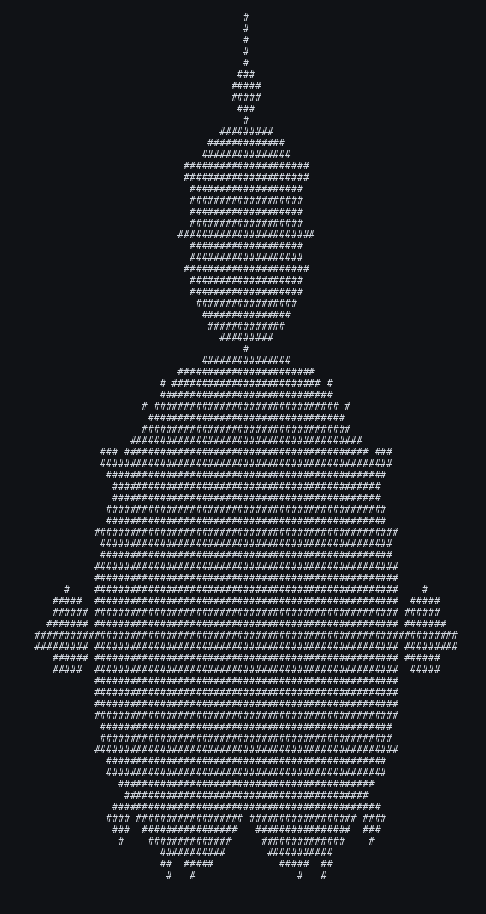

# Shed Skin examples, ported to TurboPython

Programs from the [Shed Skin](https://github.com/shedskin/shedskin) project's
[examples collection](https://github.com/shedskin/shedskin/tree/main/examples),
ported to compile and run with [TurboPython](https://tpy-lang.org).

Shed Skin does something genuinely hard: whole-program type inference over
*unannotated* Python. For close to two decades it has been showing that ordinary
Python programs can compile into fast native code, and it was a direct inspiration
for TurboPython — this collection especially, being 80+ non-trivial, self-contained
programs that people wrote to get something done, which is a far better test of a
compiler than any amount of synthetic code.

Ports are taken from upstream revision
[`690673b0`](https://github.com/shedskin/shedskin/tree/690673b0/examples)
(`v0.9.12-412-g690673b0`).

> ⚠️ These programs are **not ours**, and the repository's MIT license does not
> cover them. See [Licensing](#licensing) before reusing any of it.

## Running

```bash
cd <example-name>
tpy <example-name>.py
```

The entry point is always `<example-name>.py`. Examples needing extra setup say so
in their own README. See the [repository README](../README.md#running-an-example)
for requirements and build flags.

## Examples

Examples are added in small batches, and appear here only once they fully work.

| | example | description | lines |
| --- | ------- | ----------- | ----- |
| | [adatron](adatron/) | Adatron SVM with a polynomial kernel | 203 |
| | [ant](ant/) | Ant Colony Optimization for the Travelling Salesman Problem | 175 |
|  | [doom](doom/) | DOOM WAD renderer, drawn with SDL2 | 1496 |
|  | [mandelbrot](mandelbrot/) | The Mandelbrot set rendered as ASCII art | 43 |
|  | [oliva2](oliva2/) | Sea-shell pigmentation patterns, written as a PGM image | 159 |
|  | [path_tracing](path_tracing/) | Monte Carlo path tracer, written as a PPM image | 409 |
| | [sieve](sieve/) | Two prime sieves, Atkin's and Eratosthenes' | 120 |
|  | [voronoi](voronoi/) | A Voronoi diagram rendered as ASCII art | 59 |

---

## Licensing

These programs are not ours. Each carries its own terms, and they are not
consistent: many have an author attribution and no license statement at all, and the
rest are a mix of GPL-2, GPL-3, and custom notices. We pass each one through
unchanged, exactly as Shed Skin distributes it — we add no license of our own, and
each program reaches you under whatever terms it already carried. Provided **as-is,
with no warranty**. The repository's MIT license does **not** apply to anything in
this directory.

Before you reuse any of this code, check that example's source header and its
README, and satisfy yourself about its terms. Note that for many of them there is no
license statement to check.

If you are the author of one of these programs and want it removed or corrected,
please open an issue.

Every ported file keeps the original's copyright and license notice intact, such as
it is, and each example's README records both its origin and what we changed.

## How these ports are made

The goal is to stay **close to the original where that doesn't hurt**. Usually it
costs nothing: type annotations, occasionally a fixed-width integer type, and little
else. Where TurboPython genuinely wants a different construction — shared ownership
through `Rc`, an explicit loop in place of a builtin that isn't available yet — the
example uses the TurboPython version and its README explains what changed and why.
Showing how a program is written in TurboPython is more useful than proving nothing
changed.

Specifically, each example's README documents:

- **Origin** — the upstream path, author, and license notice, verbatim from the
  source.
- **Changes from the original** — every deviation, including annotations added.
- **TurboPython bugs worked around** — everything that stopped the port from using
  a feature the original uses, whether a compiler bug or a missing piece of Python,
  with a pointer to the upstream entry if one exists. These are meant to be
  temporary; when the compiler is fixed, the workaround goes.

Every port is checked against its original. Usually the **unmodified original** is
run under CPython, the port under TurboPython, and the two outputs must be
identical; comparing against the original rather than running the port under
CPython means there is never a reason to contort the port to keep it dual-target.
Some earlier ports were instead run under CPython themselves, which works while a
port is still ordinary Python plus annotations, and each README says which was
done. Where neither is possible — a program drawing to a window — the port was
read against the original line by line, and the README says that too.
Nondeterministic output, such as elapsed-time reports, is normalized away before
comparing; it is never removed from the program. The output verified this way is
recorded, and re-checked against the pinned compiler by `make test` — see
[`.verify/`](../.verify/README.md).

Some examples are still waiting on TurboPython features. Those gaps get filed
against the compiler, and the example waits for it to catch up rather than being
reshaped around the limitation.
