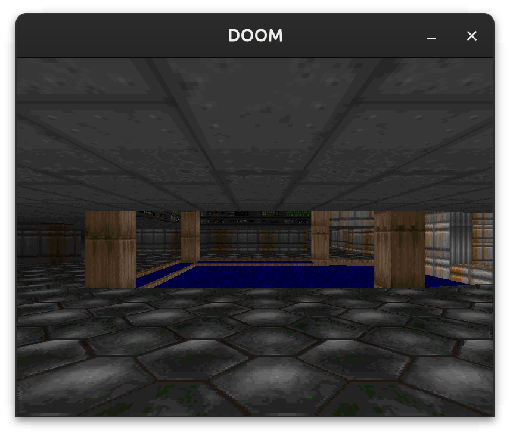

# doom

A DOOM WAD renderer: reads the original game's map data and draws it with a
software BSP renderer, in a window via SDL2. ~1200 lines across three files.



Textured walls, floors and ceilings, BSP traversal with a clip buffer, and
per-column light-level shading -- all in annotated Python.

## Origin

Ported from
[shedskin/examples/doom](https://github.com/shedskin/shedskin/tree/main/examples/doom).

Attribution and license, verbatim from the source header:

> ```
> Copyright 2023 Mark Dufour, license unclear.
>
> Based on Java implementation by Leonardo Ono:
> https://github.com/leonardo-ono/JavaDoomWADMapRendererTests
> ```

The original says its license is unclear, so treat it accordingly.

## Run

This example needs the DOOM shareware WAD, which is **not** distributed here —
it is id Software's data, not ours. Download `DOOM1.WAD` (see
[doomwiki](https://doomwiki.org/wiki/DOOM1.WAD)). SDL2 must also be installed
(`libsdl2-dev` on Debian/Ubuntu).

```bash
tpy -O doom.py path/to/DOOM1.WAD
```

Arrow keys move, ctrl+left/right strafe, `q` quits.

The WAD path is optional and defaults to `doom1.wad` in the current directory,
so dropping the file here lets you just run `tpy -O doom.py`.

## Files

| file | what it is |
| ---- | ---------- |
| `doom.py` | entry point: input, main loop, and the headless `dump` mode |
| `engine.py` | the renderer — WAD parsing, BSP traversal, span drawing |
| `pygame.py` | a small SDL2 layer standing in for the pygame calls used |

## Changes from the original

**Ownership: `Ptr` for cross-references.** The WAD data is a graph — sidedefs
point at sectors, segs at linedefs and sidedefs, linedefs at vertices. In
TurboPython a container owns what it stores, so holding these by value would
copy them and, worse, break the shared mutation the sky-hack pass relies on.
The `Map` owns every array and everything else holds `Ptr[T]` back-references.
Each array is fully built before anything points into it, so the pointers stay
valid. `Ptr` is nullable, which also covers the absent sidedef and missing
texture cases without `Optional`.

`ClipBufferNode` is the exception: it is a recursive type that *owns* its
children, so those are `Box[ClipBufferNode]`.

**`Int32(...)` instead of `int(...)` for every coordinate conversion.** In
TurboPython `int` means arbitrary-precision `BigInt`, so `int(leftX + dx * x)`
built a BigInt per pixel. This is the single most important change in the port
and it is invisible: it compiles cleanly and produces identical output.

**Widening `struct.unpack_from` results.** The macro yields exactly-sized types
(`UInt16`, `UInt8`), which then collide with ordinary `Int32` arithmetic, so
each unpacked field is widened where it is read.

**Owned copies of `bytes` slices.** Slicing `bytes` yields a non-owning view, so
anything stored in the entry table or used as a dict key takes an owned copy.

**Class order.** `Flat`, `Picture` and `Vec2` were moved above the classes that
store them by value: generated classes appear in source order with no forward
declarations, so a by-value field of a later class does not compile.

**Two hot loops were hand-optimised**, both in the floor/ceiling span drawer,
which is the large majority of a frame:

- Loop invariants hoisted (player position and direction, the depth scale, the
  texture column in the wall drawer, and the framebuffer row offset), keeping
  the original's exact groupings so the arithmetic is unchanged.
- `get_flat_colormap()` inlined into the pixel loop. It was called per pixel,
  but the two values it derives from the sector — the light cap and the
  special-lighting offset — are constant for a whole column.

**Structure.** `doom_main.py` became `doom.py` (the entry point must match the
directory) and the engine became `engine.py`. The nested `move_player` closure
became a plain function taking and returning the velocities. `WIDTH`/`HEIGHT`
carry annotations because an unannotated module-level variable is not exported.

**The pygame layer is a replacement, not an emulation.** The renderer needs a
window, a way to push an 8-bit paletted framebuffer to it, keyboard state and a
frame delay. `pygame.py` provides exactly that over SDL2, declared with
`@native` bindings — SDL's headers are not needed to build, only the library to
link. The API is flat rather than pygame's nested one. Music is dropped.

**Removed** the upstream `if __name__ == '__main__'` block at the end of the
engine, which rendered one frame as a smoke test. Shed Skin builds the engine as
an extension module, so that block was its standalone entry point; here the
engine is only ever imported.

## Notes

The entry point also has a headless mode used to verify the port:

```bash
tpy -O doom.py path/to/DOOM1.WAD dump 60     # render 60 frames -> frame.raw
```

Frames are deterministic when the player does not move, so this writes the
renderer's own 8-bit framebuffer with no window involved, and it is compared
byte for byte against the unmodified upstream engine running under CPython.
Both sides agree exactly, and every optimisation above was checked against that
comparison rather than assumed safe.
