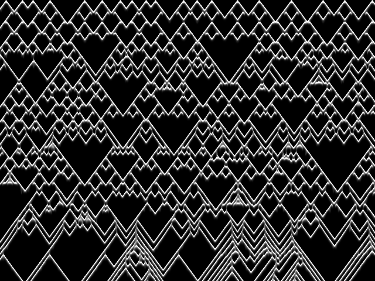

# oliva2

Simulates the pigmentation patterns on the shell of the sea snail *Oliva
porphyria*, using Meinhardt and Klingler's activator–inhibitor model, and writes
the result as a PGM image. ~159 lines.



## Origin

Ported from
[shedskin/examples/oliva2](https://github.com/shedskin/shedskin/tree/main/examples/oliva2).

Attribution, verbatim from the source header:

> ```
> Models for the simulations of the color pattern on the shells of mollusks
> see also: Meinhardt,H. and Klingler,M. (1987) J. theor. Biol 126, 63-69
> see also: H.Meinhardt: "Algorithmic beauty of sea shells"
> (Springer Verlag) (c) H.Meinhardt, Tubingen
>
> Translated by Bearophile from QBASIC to SSPython (for ShedSkin), V. 1.1, Feb 17 2006.
> ```

The original states no license.

## Run

```bash
tpy -O oliva2.py
```

Writes `oliva.pgm` (640×480, 8-bit greyscale) in the current directory. Any image
viewer will open it; `pnmtopng oliva.pgm > oliva.png` converts it.

## Changes from the original

**The file handle moved out of the class.** The original keeps the open file in a
field (`self.out_file`) and writes to it from `saverow()`. In TurboPython a `TextIO`
is usable only as a *local*: assigning an `open()` result to a `TextIO` field is
rejected, and taking one as a parameter yields a `Ref[TextIO]` that neither
satisfies the `Writable` protocol nor allows `.write()`. So `saverow()` now returns
the text to write and `oliva()`, which owns the handle, does the writing. The class
keeps all its bookkeeping — row count, width, the header-on-first-row logic and both
asserts — unchanged.

That also replaces the four `print(..., file=...)` header calls with string
building, and moves the final `close()` to the caller.

**Annotations:** signatures on both methods and on `oliva()`'s twelve parameters,
class-level field declarations (TurboPython stores fields inline and has no
`__dict__`), and element types on `a`, `b`, `out_line` and the unused
`image_matrix`, where a repeated literal would otherwise pin a narrower type.

The model itself — the reaction–diffusion loop, its constants, the boundary
handling and the output format — is untouched.

## Notes

Output is byte-identical to the original's: verified by running the unmodified
upstream program under CPython and comparing `oliva.pgm` byte for byte.

The program renders 200 shells — the original's benchmark loop — each overwriting
the last, so the final image is the one seeded with `seed(19)`.
