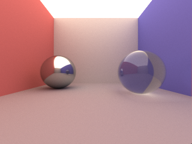

# path_tracing

A Monte Carlo path tracer: renders a Cornell box with a chrome and a glass
sphere to a PPM image. ~409 lines.



*`tpy -O path_tracing.py 10000`. Plain `tpy -O path_tracing.py` runs the
original's benchmark instead, at ten samples per pixel — far grainier.*

## Run

```bash
tpy -O path_tracing.py            # the original's timing run: ten renders at
                                  # ten samples per pixel, seeds 0..9
tpy -O path_tracing.py 2000       # one render at 2000 samples per pixel
```

Each sample per pixel is one ray traced through a randomly jittered point,
and noise falls off as roughly the square root of that count, so the default
ten is very grainy — the original's `ITERATIONS = 10` carries the comment
"should be much higher for good quality". The picture above is 10000 samples,
about nine minutes; 2000 takes under two and already looks close. Output goes
to `pt.ppm` either way, and the argument form is seeded fixedly, so a given
count always renders the same image.

## Origin

Ported from
[shedskin/examples/path_tracing](https://github.com/shedskin/shedskin/tree/main/examples/path_tracing).

Attribution and license, verbatim from the source header:

> ```
> # path tracer, (c) jonas wagner (http://29a.ch/)
> # http://29a.ch/2010/5/17/path-tracing-a-cornell-box-in-javascript
> # converted to Python by <anonymous>
> ```

There is no license statement, only the attribution above.

## Changes from the original

**Materials dispatch through a `@dynamic` protocol.** This is the interesting
change. The original is a small classic hierarchy: `Material` implements a
diffuse `bounce()`, and `Chrome` and `Glass` subclass it to override that one
method. TurboPython does have class inheritance, but it is *static*: a
subclass gets the base's fields and methods with no vtable, so `bounce()`
resolves by the declared type and every material would bounce diffusely.
Written that way, the compiler says so rather than letting it slide —

```
warning: Method 'Chrome.bounce' hides 'Material.bounce' -- any 'Material'
reference will call 'Material.bounce', not 'Chrome.bounce' (differs from
Python's dynamic dispatch); make 'Material' a @dynamic protocol for runtime
dispatch
```

— and refuses the transfer outright at `Body(..., Chrome(...))`, where storing
a `Chrome` in a `Material` slot would slice it.

Virtual dispatch is something you opt into, by rooting the hierarchy in a
protocol marked `@dynamic`:

```python
@dynamic
class Surface(Protocol):
    def bounce(self, ray: Ray, normal: V3) -> Own[V3]:
        ...

class Material(Surface):
    ...
```

That is the whole change: one new declaration naming the method that varies.
`Chrome` and `Glass` still just subclass `Material` and override `bounce`,
exactly as before, and now `hit.material.bounce(ray, normal)` dispatches
through a vtable. Only the polymorphic method is named in the protocol —
`color` and `emission` stay ordinary fields on `Material` and are read
directly.

**`Body.material` is a `Box[Material]`.** A field holding a value stores it
inline, at the base class's size, which would slice a `Glass` down to a
`Material`. `Box[T]` is the owning heap slot that preserves the dynamic type,
so the field is `Box[Material]` and the `Box` is built at the call site around
the concrete material:

```python
Body(Sphere(V3(-1.1, 2.8, 0.0), 0.5), Box(Chrome(V3(0.8, 0.8, 0.8))))
```

`Box` derefs transparently, so `hit.material.bounce(...)` and
`hit.material.color` read exactly as they did in Python.

**`hit` is a `Ptr[Body]`.** `trace()` scans the object list for the nearest
intersection and remembers the winner. In TurboPython a container owns its
elements, so binding `o = self.scene.objects[i]` by value would copy a `Body`
per test. `Ptr[Body]` is a non-owning pointer into the list, and it is
nullable, so `hit = None` and `if hit is None:` survive verbatim from the
original.

**`Own[V3]` on the vector methods.** `add`, `sub`, `mul`, `muls`, `divs`,
`normalize` and `getNormal` each build a fresh vector and hand it back;
`Own[V3]` is the return annotation that transfers it to the caller.

**Explicit `copy()` in constructors.** Storing a parameter into a field copies
it in TurboPython where CPython would alias — the compiler warns, because the
two runtimes would otherwise diverge silently. Nothing here mutates a stored
`V3` after construction, so the copy is invisible; `copy(...)` marks it as
intended rather than accidental. The one place where sharing would have
mattered — `Renderer.buffer`, which really is accumulated into — is mutated in
place through `self.buffer[i].iadd(color)` and never rebound.

**`Own` on the two constructors that take ownership.** `Body` holds a `Box`,
which is move-only, so a `list[Body]` and the `Scene` that owns it cannot be
copied. `Scene.__init__` takes `Own[list[Body]]` and `Renderer.__init__` takes
`Own[Scene]`; both move. As a consequence `Renderer.__init__` sizes its buffer
from `self.scene` rather than from the `scene` parameter, which has already
been moved from, and `iterate()` reads `self.scene` directly instead of
aliasing it into a local first.

**`Int32(x * 255)` rather than `int(x * 255)`.** In TurboPython `int` is
arbitrary-precision, so `int()` would allocate a BigInt for every colour
channel of every pixel.

**Smaller substitutions.**

- `float("inf")` → `math.inf`.
- `%`-formatting → f-strings; TurboPython has no printf-style `%` operator.
- `class V3(object)` → `class V3`; `object` is not a base class here.
- `super(Chrome, self).__init__(...)` → `super().__init__(...)`; only the
  Python 3 zero-argument form is accepted.
- `v2` and `v2_dot` in `getRandomNormalInHemisphere` are initialised before
  the `while True` loop that assigns them — locals are function-scoped and
  must be definitely assigned.
- The driver loop at module scope moved into an `if __name__ == '__main__':`
  block, with `t0` initialised before the loop that conditionally reassigns
  it.
- `ITERATIONS` gained a `Final[Int32]` annotation.

**Added: a sample count on the command line.** `main()` takes its sample
count as an argument rather than reading the `ITERATIONS` global, and with no
arguments the program runs exactly the original's ten-seed timing loop
passing `ITERATIONS`. This is the one thing here that is not in the original,
and it exists so the picture above can be reproduced without editing the
source.

## TurboPython bugs worked around

- **Call arguments evaluate right-to-left.** Python guarantees left-to-right
  evaluation; TurboPython inherits C++'s unspecified order and in practice
  reverses it, for call, constructor and method arguments, for binary operands
  (`f() - g()` calls `g()` first), and for f-string interpolations. It is
  invisible unless the subexpressions have side effects — here they draw from
  the random stream, so
  `V3(random() * 2.0 - 1.0, random() * 2.0 - 1.0, random() * 2.0 - 1.0)`
  consumed three draws backwards and every pixel came out different. The three
  draws are hoisted into separate statements in
  `getRandomNormalInHemisphere`; fold them back into the call once the
  compiler sequences arguments left-to-right.

## Verification

Output was checked by running the **unmodified original** under CPython and
comparing the no-argument run's `pt.ppm` byte for byte — the port uses `Box`
and `Ptr` auto-deref, which CPython cannot execute. Both files are identical,
which also confirms that `random` produces the same stream from the same seed
in both runtimes: the tracer draws several random numbers per bounce, so any
divergence in the sequence would change every pixel.
