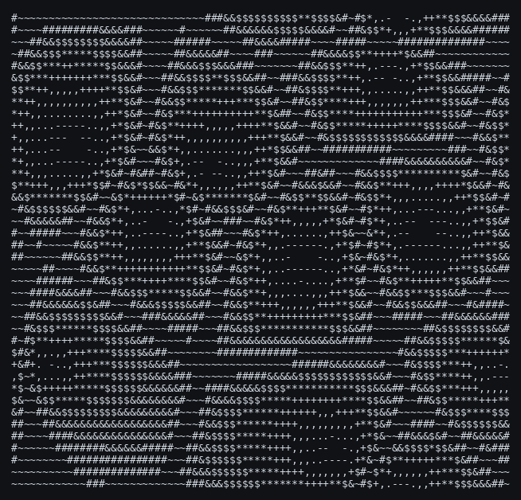

# voronoi

A Voronoi diagram rendered as ASCII art. ~59 lines.



## Origin

Ported from
[shedskin/examples/voronoi](https://github.com/shedskin/shedskin/tree/main/examples/voronoi).

Attribution, verbatim from the source header:

> ```
> # Textual Voronoi code modified from: <abhishek@ocf.berkeley.edu>
> # http://www.ocf.berkeley.edu/~Eabhishek/
> ```

The original states no license.

## Changes from the original

- Annotated the three functions. `generateRandomPoints` returns a list it builds
  itself, so its return type is `Own[list[tuple[float, float]]]` — TurboPython
  requires ownership transfer to be explicit when a function returns a value it
  created.
- `screen: list[str] = []` — an empty list literal has no element type to infer
  from at the point it is written.
- `str(...)` around `chars[...]` — indexing a `str` yields a `Char` in TurboPython,
  and `"".join()` takes an iterable of `str`.
- `print('TIME %.2f' % (time.time()-t0))` became an f-string. TurboPython has no
  printf-style `%` formatting on `str`.

The algorithm, loop structure, benchmark harness and output are the original's.

## Notes

Output is byte-identical to CPython.

The program renders 5000 diagrams — the original's benchmark loop — and prints only
the last, seeded with `seed(499)`. That makes it a good end-to-end check of
TurboPython's `random`: the entire diagram derives from a seeded Mersenne Twister
sequence, and it reproduces CPython's byte for byte.
